# ⚡ Free Multi-Tenant Enterprise Invoice & Accounting Application


**Free Enterprise Accounting Application** is a high-performance, multi-tenant open-source SaaS billing, double-entry accounting, and financial management system. Packed with 20+ feature modules, 12 dynamic PDF invoice templates, interactive Visual Drag & Drop Builder, Custom Label & Wording Editor, UAE FTA VAT 201 tax compliance, passwordless email OTP client portal, whitelabel custom domains, REST API automation, and real-time general ledger calculation engines.

---

## 🏗️ System Architecture & Workflow Diagram

The diagram below illustrates the end-to-end multi-tenant architecture, client email OTP authentication, double-entry general ledger, UAE FTA tax compliance engine, payment gateway webhooks, and background automation cron workers:

```mermaid
graph TD
    %% User Roles & Access
    subgraph Clients_Portal ["👤 Client Self-Service Portal"]
        C1["Client User"] -->|1. Enter Email| CP1["client_login.php<br/>(Request OTP)"]
        CP1 -->|2. Send 6-Digit Email Code| Mailer["Services/Mailer.php<br/>(Custom SMTP)"]
        Mailer -->|3. Email Dispatched| C1
        C1 -->|4. Verify Code| CP2["client_login.php<br/>(Verify OTP)"]
        CP2 -->|5. Authenticated Access| Portal["client_portal.php<br/>(Self-Service Hub)"]
        Portal -->|View Ledger & Pay| Gateways["Payment Gateways<br/>(Stripe, PayPal, NI, Bank Wire)"]
    end

    subgraph Core_App ["⚡ Multi-Tenant Engine"]
        Admin["Super Admin / Workspace User"] -->|HTTP / Domain Router| Layout["layout.php<br/>(Topbar & Mega Menu)"]
        
        Layout -->|Subaccounts & Branches| TenantManager["subaccounts.php<br/>(Multi-Tenant Isolation)"]
        Layout -->|Whitelabel Branding| DomainEngine["domain_settings.php<br/>(Custom Subdomains & SSL)"]
        
        Layout -->|Tax Invoices & Quotes| InvEngine["invoices.php & quotes.php<br/>(Tax Invoices & Proposals)"]
        Layout -->|Auto-Subscription Billing| SubEngine["recurring_invoices.php<br/>(Weekly/Monthly Profiles)"]
        Layout -->|Client CRM & Import| ClientCRM["clients.php & client_import.php<br/>(Zoho / QB / Xero Importer)"]
        Layout -->|Expenses & Receipts| ExpEngine["expenses.php<br/>(Expense Tracking)"]
        
        Layout -->|12 PDF Layout Designs| TemplateEngine["invoice_customize.php<br/>(Template Gallery & Drag & Drop)"]
    end

    subgraph Background_Workers ["🤖 Automation & Cron Jobs"]
        CronWorker["cron_recurring.php<br/>(Daily Background Worker)"] -->|Generate Due Invoices| InvEngine
        CronWorker -->|Post GL Entries| Ledger
        CronWorker -->|Send Client Receipts| Mailer
    end

    subgraph Accounting_GL ["📚 Double-Entry Accounting & UAE Tax Engine"]
        InvEngine -->|Post Sales Journal| Ledger["Services/AccountingService.php<br/>(Chart of Accounts & GL)"]
        ExpEngine -->|Post Expense Journal| Ledger
        Gateways -->|Async Webhook Sync| WebhookEngine["api/v1/webhooks/stripe.php<br/>& stripe_return.php"]
        WebhookEngine -->|Record Payment & Update Status| Ledger
        
        Ledger -->|Filing Data| VAT201["reports_vat201.php<br/>(UAE FTA VAT 201 Return)"]
        Ledger -->|Audit Export| FAF["export_faf.php<br/>(FTA Audit File .faf)"]
        Ledger -->|9% Liability| CTax["reports_corporate_tax.php<br/>(UAE Corporate Tax Engine)"]
        Ledger -->|P&L, Balance Sheet, Aging| Reports["reports_pnl.php & reports_balance_sheet.php"]
    end

    subgraph Integrations ["🔌 External Integrations & API"]
        Layout -->|Meta WhatsApp Cloud API| WhatsApp["whatsapp_settings.php<br/>(Automated WhatsApp PDF)"]
        Layout -->|Automations Engine| N8N["automation.php<br/>(n8n Workflow Automation)"]
        Layout -->|Scoped REST API| APIKeys["api_keys.php<br/>(API Key Manager & REST API v1)"]
    end

    %% Styles
    classDef primary fill:#0f172a,stroke:#f59e0b,stroke-width:2px,color:#ffffff;
    classDef success fill:#064e3b,stroke:#10b981,stroke-width:2px,color:#ffffff;
    classDef accent fill:#312e81,stroke:#6366f1,stroke-width:2px,color:#ffffff;
    classDef warning fill:#78350f,stroke:#f59e0b,stroke-width:2px,color:#ffffff;

    class Layout,Portal,Ledger primary;
    class VAT201,FAF,CTax success;
    class SubEngine,CronWorker warning;
    class Gateways,WebhookEngine,WhatsApp,N8N accent;
```



---

## 🌟 Key Features & Capabilities

### 🎨 12 PDF Invoice Templates, Drag & Drop Builder & Label Customizer
- **Visual Drag & Drop Builder (`invoice_builder.php`)**: Reorder components (Header, Metadata, Client Info, Item Table, Financial Totals, Bank Remittance, Terms, Signature/Stamp, QR Verification) visually with live WYSIWYG canvas feedback.
- **In-Canvas & Sidebar Editing**: Edit labels (e.g. `TAX INVOICE`, `OFFICIAL BILL`, `TRN / Tax ID`) and color themes (Primary Accent Color, Header Text Color) directly on the canvas or sidebar.
- **Tenant Isolation**: Custom layouts and wording overrides save per `tenant_id` without cross-tenant conflicts.
- **12 Modern PDF Designs**: Custom Drag & Drop Template, Modern Minimal, Corporate Executive, Creative Vibrant, Tech Glassmorphism, Sleek Dark, Compact Thermal POS Receipt, Elegant Serif, Swiss Grid, Borderless Clean, Two-Column Split, and OneSol Executive Gold.

### 🇦🇪 UAE FTA Tax & Corporate Tax Compliance
- **Official FTA VAT 201 Declaration Return**: Formatted to match UAE Federal Tax Authority (FTA) Form 201 layout with Box 1a–1g breakdowns across all 7 Emirates (Dubai, Abu Dhabi, Sharjah, Ajman, UAQ, RAK, Fujairah).
- **Official FTA Audit File (.faf) Generator**: 1-Click export of the pipe-delimited `.faf` text audit file required by FTA auditors containing Header, Sales, and Purchase ledgers.
- **UAE Corporate Tax (9%) & Threshold Estimator**: Compliant with Federal Decree-Law No. 47 of 2022 — tracks the AED 375,000 Small Business Relief (SBR) threshold & 9% Corporate Tax liability.
- **Tax Invoice & TRN Validation**: Supports 15-digit Seller & Buyer TRN numbers, 5% standard VAT rate, zero-rated exports (0%), and exempt items.
- **Dual AED Currency Engine**: Native support for AED (UAE Dirham) with automatic CBUAE conversion rates for foreign currencies (USD, EUR, GBP, SAR).

### 🔑 Security & Self-Service Client Portal
- **Passwordless Client OTP Authentication (`client_login.php`)**: Secure 6-digit email OTP single-use login with session regeneration (`session_regenerate_id(true)`).
- **Forgot Password System (`forgot_password.php` & `reset_password.php`)**: Secure SMTP token-based password reset for workspace admins and users.
- **Whitelabel Custom Domains (`domain_settings.php`)**: Bind custom subdomains (e.g. `billing.yourcompany.com`) with live AJAX DNS verification checks.

### 📊 Double-Entry General Ledger & Reporting Suite
- **Profit & Loss Statement (P&L)**: Gross Revenue vs Business Expenses with Net Profit calculation.
- **Balance Sheet**: Cash & Receivables, Net VAT Obligations, and Retained Earnings satisfying $\text{Assets} = \text{Liabilities} + \text{Equity}$.
- **Accounts Receivable (A/R) Aging Report**: 30 / 60 / 90+ day overdue buckets.
- **Universal CSV & PDF Exports**: 1-click CSV file downloads across all reporting pages.

### 🔄 Auto-Subscription Billing & Integrations
- **Subscription Billing Manager (`recurring_invoices.php`)**: Automated recurring billing profiles (Weekly, Monthly, Quarterly, Yearly).
- **Stripe & Webhook Integration**: Online credit card payment sync via webhooks.
- **Meta WhatsApp Cloud API Integration**: Direct PDF invoice and payment link dispatches via WhatsApp.
- **Universal CRM Importer**: Migration wizard (`client_import.php`) to import client directories from Zoho Books, QuickBooks, Xero, or CSV files.

---

## 🛠️ Technology Stack

- **Backend**: PHP 8.3 (Object-Oriented, PDO MySQL, CSRF protection, PSR-4 structure)
- **Database**: MySQL 8.0 / MariaDB
- **Frontend**: HTML5, Vanilla JavaScript (ES6+), Tailwind CSS 3.4, FontAwesome 6 Pro
- **Caching**: Redis 7.0 (with fallback to file-based TTL cache)
- **Deployment**: Docker, Docker Compose, Laragon, XAMPP, Nginx, Apache

---

## 🚀 Quick Start Guide

### Option 1: Docker (1-Click Deployment)

Clone the repository and launch the full stack (PHP 8.3, Nginx, MySQL 8, Redis 7):

```bash
git clone https://github.com/Haris-khan-Durrani/Free-Accounting-Application.git
cd Free-Accounting-Application
```

**Windows:**
```cmd
docker-start.bat
```

**Linux / macOS:**
```bash
chmod +x docker-start.sh
./docker-start.sh
```

Access the application at: **`http://localhost:8080`**

---

### Option 2: Local Web Server (Laragon / XAMPP / WAMP)

1. **Clone the repository into your web root (`www` or `htdocs`):**
   ```bash
   git clone https://github.com/Haris-khan-Durrani/Free-Accounting-Application.git
   ```

2. **Database Setup:**
   - Create a MySQL database named `onesol_invoices`.
   - Import the database schema from **`database.sql`**.

3. **Database Configuration (`config.php`):**
   ```php
   define('DB_HOST', '127.0.0.1');
   define('DB_NAME', 'onesol_invoices');
   define('DB_USER', 'root');
   define('DB_PASS', '');
   ```

4. **Access the application:**
   Open `http://localhost/Free-Accounting-Application` in your browser.

---

## 🔑 Default Login Credentials

| Account Role | Email Address | Default Password |
| :--- | :--- | :--- |
| **Super Admin / Owner** | `admin@onesol.ae` | `admin123` |

---

## 🔌 REST API Endpoints

| Method | Endpoint | Description |
| :--- | :--- | :--- |
| `GET` | `/api/v1/invoices` | List invoices with status & date filters |
| `POST` | `/api/v1/invoices` | Create a new tax invoice programmatically |
| `GET` | `/api/v1/clients` | List client accounts |
| `POST` | `/api/v1/clients` | Register a new client account |
| `POST` | `/api/v1/payments` | Record an invoice payment |
| `GET` | `/api/v1/reports/summary` | Fetch real-time revenue & expense summary |

Interactive API testing console available at: **`/api_playground.php`**

---

## 📄 License

This project is open-source software licensed under the **[MIT License](LICENSE)**. Free for commercial and personal use.
